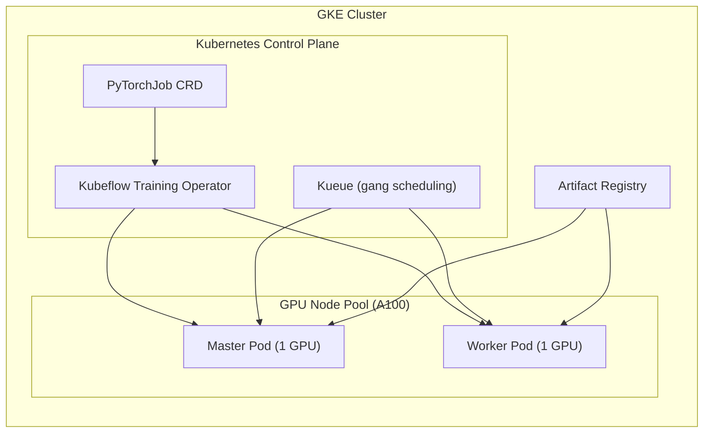
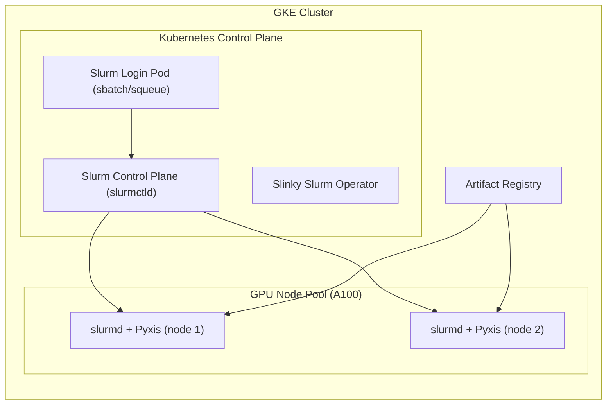

# GKE A100 Sandbox (Terraform + Kubernetes Manifests)

This repo provisions a GKE cluster with A100 GPUs and a CPU node pool, then installs GPU enablement and ML components via Kubernetes manifests.

## Prereqs
- `gcloud`, `terraform`, `kubectl`, `kustomize` (or `kubectl apply -k` support)
- GCP project with quota for A100 GPUs in `us-central1`

## 1) Authenticate and set project
```bash
gcloud auth login
gcloud auth application-default login

gcloud config set project YOUR_PROJECT_ID
gcloud config set compute/region us-central1
gcloud config set compute/zone us-central1-a
```

## 2) Enable required APIs (once per project)
```bash
gcloud services enable \
  compute.googleapis.com \
  container.googleapis.com \
  iam.googleapis.com \
  serviceusage.googleapis.com \
  artifactregistry.googleapis.com
```

## 3) Terraform: create VPC + GKE + node pools
All Terraform files live in `infra/`.

### Configure variables
```bash
cp infra/terraform.tfvars.example infra/terraform.tfvars
```
Edit `infra/terraform.tfvars`:
```
project_id      = "YOUR_PROJECT_ID"
admin_cidr      = "0.0.0.0/0"
region          = "us-central1"
node_locations  = ["us-central1-a"]

cpu_node_count   = 3
cpu_machine_type = "e2-standard-8"  # or n2-standard-8

gpu_node_count   = 1  # 1 node, 2x A100 40GB (a2-highgpu-2g)
gpu_machine_type = "a2-highgpu-2g"
gpu_type         = "nvidia-tesla-a100"
gpu_count_per_node = 2
```

### Apply
```bash
cd infra
terraform init
terraform plan
terraform apply
```

### Get kubeconfig
```bash
gcloud container clusters get-credentials gke-a100 --region us-central1 --project YOUR_PROJECT_ID
```

## 4) Kubernetes installs (manifests)
All manifests live in `k8s/`.

### 4.1 NVIDIA device plugin (required for GPU scheduling)
```bash
kubectl apply -f k8s/nvidia/device-plugin.yaml
```

### 4.2 GPU test (nvidia-smi)
```bash
kubectl apply -f k8s/nvidia/gpu-test.yaml
kubectl logs job/nvidia-smi-test
```
Cleanup (optional):
```bash
kubectl delete job nvidia-smi-test
```

### 4.3 Kueue (use server-side apply)
Kueue CRDs can exceed the client-side annotation size limit, so use server-side apply:
```bash
kubectl apply --server-side -f k8s/kueue/manifests.yaml
```

Create Kueue queues for gang scheduling:
```bash
kubectl create ns training --dry-run=client -o yaml | kubectl apply -f -
kubectl apply -f k8s/kueue/queues.yaml
```

### 4.4 Kubeflow Training Operator (use server-side apply)
Create the namespace first, then use server-side apply because some CRDs exceed the client-side annotation size limit:
```bash
kubectl create ns kubeflow --dry-run=client -o yaml | kubectl apply -f -
kubectl apply --server-side -k k8s/kubeflow-training-operator
```

### 4.5 Training jobs (two options)
You can run the two training jobs with either:
- Kubeflow + Kueue (PyTorchJob CRDs, gang scheduling)
- Slurm (Slinky operator + Pyxis)

**Architecture**
Kubeflow + Kueue:


Slurm (Slinky + Pyxis):


#### 4.5.0 Kubeflow + Kueue layout
Kubeflow-based training jobs live under `training-job-kubeflow/` with source code, Dockerfiles, build scripts, and PyTorchJob manifests.
Slurm-based training jobs live under `training-job-slurm/` with similar code and Slurm submission scripts.

If you are on an ARM Mac, build for amd64:
```bash
export PLATFORM=linux/amd64
```
Create an Artifact Registry repo (one-time):
```bash
gcloud artifacts repositories create gke-training \
  --repository-format=docker \
  --location=us-central1 \
  --description="GKE training images"
```

#### 4.5.1 Housing price prediction (DDP, 2x A100)
Build and push the image:
```bash
cd training-job-kubeflow/housing
export PROJECT_ID=YOUR_PROJECT_ID
export REGION=us-central1
export REPO=gke-training
# If local build fails, use Cloud Build:
# export CLOUD_BUILD=1
# export CLOUD_BUILD_MACHINE_TYPE=e2-highmem-8
./build_and_push.sh
```
Submit the job:
```bash
export PROJECT_ID=YOUR_PROJECT_ID
envsubst < training-job-kubeflow/housing/pytorchjob.yaml | kubectl apply -f -
kubectl get pytorchjob -n training
kubectl get pods -n training
```

#### 4.5.2 Nemotron 4B healthcare fine-tune (LoRA, DDP, 2x A100)
Build and push the image:
```bash
cd training-job-kubeflow/nemotron4b
export PROJECT_ID=YOUR_PROJECT_ID
export REGION=us-central1
export REPO=gke-training
./build_and_push.sh
```
Submit the job:
```bash
export PROJECT_ID=YOUR_PROJECT_ID
envsubst < training-job-kubeflow/nemotron4b/pytorchjob.yaml | kubectl apply -f -
kubectl get pytorchjob -n training
kubectl get pods -n training
```
If you see `Disabling PyTorch because PyTorch >= 2.4 is required`, rebuild the image. The Dockerfile uses PyTorch 2.4+.
If you see `KeyError: '-'` from `configuration_nemotron_h.py`, rebuild the image. The Dockerfile pins `transformers==4.48.3` (tested in the model card).
If you see build errors for `mamba-ssm` or `causal-conv1d`, the Dockerfile uses a `*-devel` CUDA image to provide `nvcc` for compiling those extensions.
If you see CUDA mismatch errors during build, ensure you rebuilt with the latest Dockerfile which installs `mamba-ssm` and `causal-conv1d` using `--no-build-isolation`.

These PyTorchJobs are labeled with `kueue.x-k8s.io/queue-name: training-queue`, so they are gang scheduled by Kueue.

#### 4.5.3 Job status and logs
```bash
kubectl get pytorchjob -n training
kubectl get pods -n training -o wide
kubectl logs -n training -l training.kubeflow.org/job-name=housing-price-train --all-containers=true
kubectl logs -n training -l training.kubeflow.org/job-name=nemotron4b-healthcare-finetune --all-containers=true
```

### 4.6 Slurm (Slinky operator)
This installs Slurm on Kubernetes and enables Pyxis for containerized jobs (`srun --container-image`). The values file in `k8s/slinky/values-slurm.yaml` is preconfigured for A100 nodes and a `gpu` partition.

Install (one-time):
```bash
export SLINKY_VERSION=1.0.0
./k8s/slinky/install.sh
kubectl -n slurm get pods
```

If you need to change GPU node selection or partition defaults, edit:
`k8s/slinky/values-slurm.yaml`

#### 4.6.1 Slurm jobs (housing price prediction)
Build/push the image (same as Kubeflow job) if you have not already:
```bash
cd training-job-slurm/housing
export PROJECT_ID=YOUR_PROJECT_ID
export REGION=us-central1
export REPO=gke-training
./build_and_push.sh
```

Submit the job (from a Slurm login pod):
```bash
export PROJECT_ID=YOUR_PROJECT_ID
export HOUSING_IMAGE=us-central1-docker.pkg.dev/${PROJECT_ID}/gke-training/housing-price-train:latest

kubectl -n slurm get pods
export SLURM_LOGIN_POD=<login-pod-name>  # e.g., from `kubectl -n slurm get pods | grep login`
kubectl -n slurm exec -i "${SLURM_LOGIN_POD}" -- sbatch - < training-job-slurm/housing/slurm-job.sbatch
```

Check status:
```bash
kubectl -n slurm exec -it "${SLURM_LOGIN_POD}" -- squeue
kubectl -n slurm exec -it "${SLURM_LOGIN_POD}" -- sinfo
```

#### 4.6.2 Slurm jobs (Nemotron 4B LoRA fine-tune)
Build/push the image (same as Kubeflow job) if you have not already:
```bash
cd training-job-slurm/nemotron4b
export PROJECT_ID=YOUR_PROJECT_ID
export REGION=us-central1
export REPO=gke-training
./build_and_push.sh
```

Submit the job:
```bash
export PROJECT_ID=YOUR_PROJECT_ID
export NEMOTRON_IMAGE=us-central1-docker.pkg.dev/${PROJECT_ID}/gke-training/nemotron4b-finetune:latest

kubectl -n slurm get pods
export SLURM_LOGIN_POD=<login-pod-name>  # e.g., from `kubectl -n slurm get pods | grep login`
kubectl -n slurm exec -i "${SLURM_LOGIN_POD}" -- sbatch - < training-job-slurm/nemotron4b/slurm-job.sbatch
```

Check status:
```bash
kubectl -n slurm exec -it "${SLURM_LOGIN_POD}" -- squeue
kubectl -n slurm exec -it "${SLURM_LOGIN_POD}" -- sinfo
```

### 4.7 vLLM Nemotron 3 Nano (single-node, 2x A100)
```bash
kubectl apply -f k8s/vllm/nemotron-vllm.yaml
kubectl get pods -n vllm
```
This deployment requests 2 GPUs per pod and uses `--tensor-parallel-size 2`, so it requires a 2‑GPU node (e.g., `a2-highgpu-2g`).

### 4.8 vLLM Nemotron 3 Nano (multi-node Ray launcher, 2x A100 on separate nodes)
This runs a **single vLLM server** sharded across **2 nodes with 1 GPU each** using Ray.

```bash
kubectl delete deployment -n vllm nemotron-nano-vllm
kubectl apply -f k8s/vllm/nemotron-fp8-multinode-ray.yaml
kubectl get pods -n vllm -o wide
```

Expose vLLM with a LoadBalancer:
```bash
kubectl apply -f k8s/vllm/vllm-ray-head-lb.yaml
kubectl get svc -n vllm -o wide
```

Test the API:
```bash
export VLLM_LB_IP=<EXTERNAL-IP>
curl http://$VLLM_LB_IP:8000/v1/models
```

If you need to pull from Hugging Face private models, create a token secret:
```bash
kubectl create secret generic hf-token -n vllm --from-literal=token=YOUR_HF_TOKEN
```

## Notes
- GPU driver install is handled by GKE based on the GPU node pool configuration in Terraform.
- NVIDIA device plugin is still required to advertise GPUs to Kubernetes.
- `admin_cidr = "0.0.0.0/0"` opens SSH/ICMP to nodes from anywhere. Acceptable for sandbox, not for production.

## Cleanup
```bash
cd infra
terraform destroy
```
# gke-distributed-training
